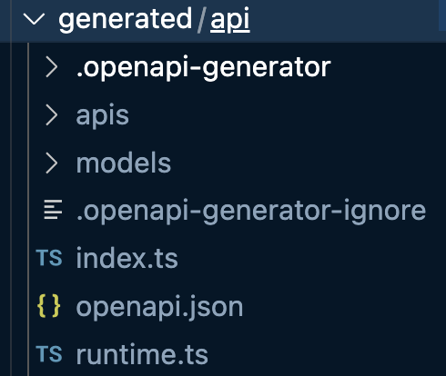

### Objective

Dynamically generate a Typescript requests file for calling FastAPI

This allows us to easily call our FastAPI with the function names that exists in requests vs. hard-coding paths.

### How to

1. Run your FastAPI, eg http://localhost:8080/docs should be live
2. Run the script in `scripts/get-openapi-spec.ts`
3. Add the dev/build scripts from `package.json` to your project
4. Run `npm run dev` or `npm run api-build` - this should generate a `generated/api` folder that looks like the below:

 
5. Add a requests.ts file for accessing your API (ours is called coreAPI)
6. Add a request like that in `sample.ts` to your web project 🎉
